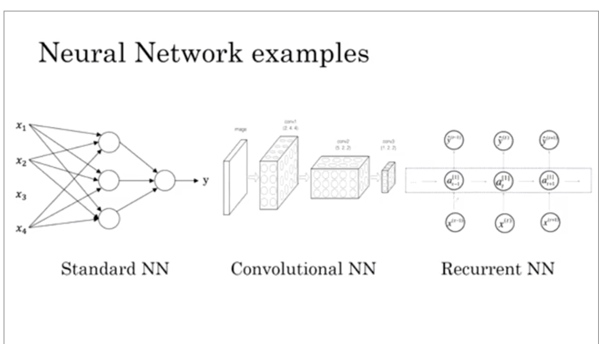

# Week 1: Total 45min

## 01 - Welcome

- ai is the new electricity
- will transform nearly every industry

Topics, about 2-4 Weeks each:
1. Neural Networks and Deep Learning (Foundation) -> Cat Recognizer (4 weeks)
2. Improving Deep Neural Networks: Hyperparameter tuning, Regularization (3 weeks)
3. Structuring your Machine Learning project (train/dev/test) (2 weeks)
4. CNN: Convolutional Neural Networks
5. NLP: Natural Language Processing: Building sequence models (RNN, LSTM)

## Introduction to Deep Learning
### 02 - What is a Neural network 

- imagine house price prediction, size of house & price
- linear regression: could be straight line, but dont get negative
- can also be a simple NN
- size x -> into "neuron" -> outputs price y
- 0 and then ax : ReLu Function (Rectified Linear Unit)

new example
- get more features size, # bedrooms, family size : f (size, bedrooms)
- add zip code or some more features wealth
- with hidden layer with computed functions like: family size, walkability, school quality
- so all hidden unit: family size, walkability, school quality -> output price y
- neural network just needs X, y -> will figure out hidden layer by itself
- hidden unit gets all input features X: density connected
- neural network is very powerful for supervised learning

### 03 - Supervised Learning with Neural Networks

Supervised learning
- you have Input(x) and Output (y) -> Real Estate
- Advertising, user info -> Output Click on ad
- Input Image -> Output for Photo tagging
- Audio -> Text Transcript
- English -> Chinese: Machine translation
- Image, Radar info -> Position of others car: Autonomous driving

different applications require different architecture
- standard NN for Real Estate
- for Image applications: CNN
- sequence data like Audio, 1D time series : RNN (Recurrent NN)
- or combine: Custom / Hybrid architecture

- can be seperated to structured data
  - tabular data: size, bedrooms, ... , price
  - all features have defined meaning
- unstructured data (harder to interprete for pc)
  - raw audio files
  - image files
  - text
- with deep learning computers can do better interpretation in unstructured data

### 04 - Why is Deep Learning taking off

- plot data available vs performance from algorithm
- traditional algorithming (SVM, logistic regression) will improve for some time, but will be stuck pretty soon
- gathered a lot of data in the last 20 years, which are mostly "unused / not useful"
- all sensors accumulates more data
- small NN: performs little bit better, but will continue growing more
- medium and large NN : much better
- Scale: Size of NN, m: amount of data (labeled data (X,y))
- for small training sets: performance is not really ordered, some traditional methods could work better
- for very big data: large NN dominating other approaches
- some algorithm changes also improves it: sigmoid function to ReLu function, 
  - gradient descent with parameter nearly 0 will train very slowly
  - ReLu gradient will be 1 always, faster gradient descent
- faster computation speeds up experimental results from like 1 month down to 1 day
  - iterate much faster, improve ideas faster

### 05 - About this course

Course 1 is about fundamentels, how to build a deep neural network

- Week 1: Introduction
- Week 2: Basics of NN : Backpropagation + Exercises
- Week 3: 1 hidden Layer NN
- Week 4: Deep NN (multiple hidden Layer NN)

### 06 - Course Resources

# Week 2: Total 