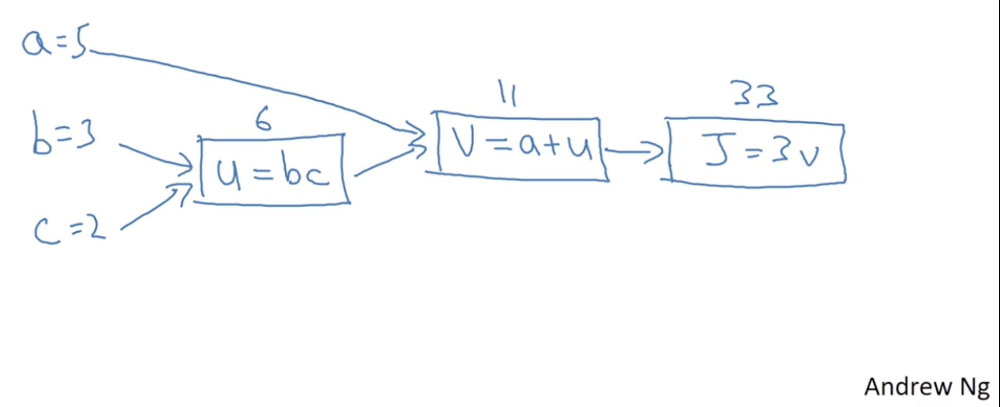

# Week 1: Total 45min

- 18.5.: Lesson 1 - 

## 01 - Welcome

- ai is the new electricity
- will transform nearly every industry


Topics, about 2-4 Weeks each:
1. Neural Networks and Deep Learning (Foundation) -> Cat Recognizer (4 weeks)
2. Improving Deep Neural Networks: Hyperparameter tuning, Regularization (3 weeks)
3. Structuring your Machine Learning project (train/dev/test) (2 weeks)
4. CNN: Convolutional Neural Networks
5. NLP: Natural Language Processing: Building sequence models (RNN, LSTM)


## Introduction to Deep Learning
### 02 - What is a Neural network 

- imagine house price prediction, size of house & price
- linear regression: could be straight line, but dont get negative
- can also be a simple NN
- size x -> into "neuron" -> outputs price y
- 0 and then ax : ReLu Function (Rectified Linear Unit)


new example
- get more features size, # bedrooms, family size : f (size, bedrooms)
- add zip code or some more features wealth
- with hidden layer with computed functions like: family size, walkability, school quality
- so all hidden unit: family size, walkability, school quality -> output price y
- neural network just needs X, y -> will figure out hidden layer by itself
- hidden unit gets all input features X: density connected
- neural network is very powerful for supervised learning

### 03 - Supervised Learning with Neural Networks

Supervised learning
- you have Input(x) and Output (y) -> Real Estate
- Advertising, user info -> Output Click on ad
- Input Image -> Output for Photo tagging
- Audio -> Text Transcript
- English -> Chinese: Machine translation
- Image, Radar info -> Position of others car: Autonomous driving


different applications require different architecture
- standard NN for Real Estate
- for Image applications: CNN
- sequence data like Audio, 1D time series : RNN (Recurrent NN)
- or combine: Custom / Hybrid architecture


- can be seperated to structured data
  - tabular data: size, bedrooms, ... , price
  - all features have defined meaning
- unstructured data (harder to interprete for pc)
  - raw audio files
  - image files
  - text
- with deep learning computers can do better interpretation in unstructured data

### 04 - Why is Deep Learning taking off

- plot data available vs performance from algorithm
- traditional algorithming (SVM, logistic regression) will improve for some time, but will be stuck pretty soon
- gathered a lot of data in the last 20 years, which are mostly "unused / not useful"
- all sensors accumulates more data
- small NN: performs little bit better, but will continue growing more
- medium and large NN : much better
- Scale: Size of NN, m: amount of data (labeled data (X,y))
- for small training sets: performance is not really ordered, some traditional methods could work better
- for very big data: large NN dominating other approaches
- some algorithm changes also improves it: sigmoid function to ReLu function, 
  - gradient descent with parameter nearly 0 will train very slowly
  - ReLu gradient will be 1 always, faster gradient descent
- faster computation speeds up experimental results from like 1 month down to 1 day
  - iterate much faster, improve ideas faster

### 05 - About this course

Course 1 is about fundamentels, how to build a deep neural network

- Week 1: Introduction
- Week 2: Basics of NN : Backpropagation + Exercises
- Week 3: 1 hidden Layer NN
- Week 4: Deep NN (multiple hidden Layer NN)

### 06 - Course Resources

# Week 2: Total 2h / 4,25 h (estimated)

## Logistic Regression as a Neural Network

### 07 - Binary Classification

- important concepts: dont use for loops for training data, instead do matrix multiplication
- how to organize forward and backward propagation
- make ideas easier to understand using logistic regression


logistic regression:
- algorith for binary classification
- e.g. image label -> cat (1) vs non-cat (0)
- image is stored as 3 matrixes for rgb channels
- image with 64x64x3
- make image to feature vector $x = matrix$ with 
- $n = n_x = 12288 = 64x64x3$
- learn how to do $x-> y$

Notation:
- $(x,y)   x \in \reals $
- m training examples $({x^1, y^1 })$
- $m_{train}$ , $m_{test}$
- $X =$ matrix with m columns, rows: $n_x$
- `X.shape = $(n_x, m)$`
- Y shape = 1,m

### 08 - Logistic Regression

- is a learning algorithm for supervised learning: binary classification
- given x, want prediction for y (aka: y_hat = P(y=1 | x))
- Parameters for logistic regression: $w \in \reals, b \in \reals $
- Output $y_{hat} = w^Tx + b $
- could be bigger than 0 or negative, but we want a prop between 0,1
- so add sigmoid $y_{hat} = \sigma ( w^Tx +b )$
- and simply $w^Tx +b = z$
- $y_{hat} = \sigma(z)$ with $\sigma(z) = \frac{1}{1+e^{-z}}$
  - if z large $\sigma(z) \approx \frac{1}{1+0} = 1 $
  - if z negative number $\sigma(z) \approx \frac{1}{1+ BIG} \approx 0$
- alternative version: b is part of $\Theta$ with $x_0 = 1$
- easier for implementation with seperation between w,b

### 09 - Logistic Regression : Cost Function

- $x^{(i)}$ : ith example from training data
- Loss (error) function $ L(\hat{y}, y) = \frac{1}{2} (\hat{y} - y)^2$ 
- squared error would be okay, but wont work good with gradient descent (is not convex, hard to optimize)
- $L(\hat{y}, y) = - ( y \log \hat{y} + (1-y) \log (1 - \hat{y}) )$
  - if $y=1$ -> $L= - log \hat{y}$, so $\log \hat{y}$ large, $\hat{y}$ should be large
  - if $y=0$ -> $L = - log (1- \hat{y})$, so $\log 1- \hat{y}$, $\hat{y}$ should be small
- define Cost function for entire training data $J (w,b) = \frac{1}{m} \sum_{i=1}^m L ( \hat{y}^{(i)}, y^{(i)})$
- **Loss function**: 1 training example
- **Cost function**: entire training data

### 10 - Gradient Descent

- $\hat{y} = \sigma( w^T x + b), \sigma(z) = \frac{1}{1+e^{-z}}$
- $J (w,b) = \frac{1}{m} \sum_{i=1}^m L ( \hat{y}^{(i)}, y^{(i)}) = - \frac{1}{m} \sum_{i=1}^m ( y \log \hat{y} + (1-y) \log (1 - \hat{y}) )$
- want to find w,b to minimize $J(w,b)$
- if w is 2-dimensional, we have some 3d surface for the function
- $J$ is a convex function, so it has one global minima
- no matter where you initialize w,b it will always get to the minima
- Gradient descent will take 1 step and go downhill to the optimum or very close


details of gradient descent:
- repeat $w := w - \alpha \frac{d J(w,b)}{dw}$ with learning rate $\alpha$
- repeat: $b:= b - \alpha \frac{D J(w,b)}{db}$ 
  - also known as "partial derivative "$\frac{\partial J(w,b)}{\partial w}$, but we dont mind using partial symbols
  - for code we will just use $dw, db$ as variables
- dw: will represent derivative inside code -> $w:= w - \alpha dw$
- algorithm will slowly decrease parameter if derivative is positive $w$ - move to left

### 11 - Derivatives

- you dont need a deep understanding of calculus to apply deep learning
- later on we will abstract everything inside functions
- but before we will take a look inside this box
- just watched video, because its quite easy

### 12 - Derivative Examples

- just watched video, because its quite easy

### 13 - Computation graph

- $J(a,b,c) = 3 (a+bc)$
- 3 steps to compute: 
  - $u=bc$
  - $v=a+u$
  - $J=3v$


- forward propagation: from left-to-right path we can compute J 
- backward propagation: from right-to-left we can get derivatives

### 14 - Derivatives with a computation graph

- $\frac{dJ}{dv} = ?$ 
- $J=3v$, v = 11 (value from forward prop)
- $J=3v = 3 * 11 = 33$ 
- $\frac{dJ}{dv} (3v) = 3$: 1 Step backwards is enough
- $\frac{dJ}{da} = \frac{dJ}{da} 3v = \frac{dJ}{da} 3(a+u) = 3 * 1 = 3$
- if we increase a by 0.001, v increases by 0.001 -> but v affects J by 3 times. 
- $\frac{dJ}{da} = 3 = \frac{dJ}{dv} * \frac{dv}{da} = 3*1$
- *final output Variable* = $\frac{dFinalOutputVar}{d var}$ 
  - should be written in code like: `dvar`: derivative of final variable, like J


- $dv=3$ -> $da=3$
- $du= \frac{dJ}{du} = 3 = \frac{dJ}{dv} * \frac{dv}{du} = 3*1$
- $db= \frac{dJ}{db} = \frac{dJ}{du} * \frac{du}{db} = 3 * 2 = 6$
- $dc = 3*3 = 9$
- so with right-to-left we computed derivatives by backward propagation

### 15 - Logistic Regression Gradient Descent

- Recap: 
  - $\hat{y} = \sigma( w^T x + b), \sigma(z) = \frac{1}{1+e^{-z}}$
  - $J (w,b) = \frac{1}{m} \sum_{i=1}^m L ( \hat{y}^{(i)}, y^{(i)}) = - \frac{1}{m} \sum_{i=1}^m ( y \log \hat{y} + (1-y) \log (1 - \hat{y}) )$
- for two samples
- $z=w_1 x_1 + w_2 x_2 + b$ -> $\hat{y} = a = \sigma(z)$ -> $L(a,y)$

- lets do backward propagation for derivatives
- $da = \frac{dL}{da} = - \frac{y}{a} + \frac{1-y}{1-a}$
- $dz = \frac{dL}{dz} = \frac{dL}{da} \frac{da}{dz} = da * a(1-a) =  - \frac{y}{a} + \frac{1-y}{1-a} * a(1-a) = a-y$
- final step: computing feature derivatives
  - $dw_1 = x_1 * dz$
  - $dw_2 = x_2 * dz$
  - $d_b = dz$
- updates inside: 
  - $w_1 := w_1 - \alpha dw_1$
  - $w_2 := w_2 - \alpha dw_2$
  - $b := b - \alpha db$

Next video will show same technique, but not for 1 dataset like here

### 16 - Gradient Descent on m Examples

- $J(w,b) = \frac{1}{m} \sum_{i=1}^m L(a^{(i)},y)$
- $a^{(i)} = \hat{y}^{(i)} = \sigma(z ^{(i)}) = \sigma ( w^T x^{(i)} + b)$
- $\frac{d}{dw_1} J(w,b) = \frac{1}{m} \sum_{i=1}^m \frac{d}{dw_1} * L =  \frac{1}{m} \sum_{i=1}^m  = dw_i^{(i)}$

take this to algorithm:
- init $J=0, dw_1 = 0, dw_2 = 0, db = 0$


just 1 step for gradient descent for n=2
- $w_1 := w_1 - \alpha dw_1$
- $w_2 := w_2 - \alpha dw_2$
- $b := b - \alpha db$

- will result in 2 for loops: all n features, all m examples
- for loops will make algorithm inefficient
- algorithm without loops will better scale
- use vectorization to avoid for loops
- was nice to have before, but is now essentially

## Python and Vectorization

### 17 - Vectorization

- $z = w^T x + b$, where $w, x \in \reals^{n_x}$
- for loops is very slow
- vectozired: $z = np * dot (w,x) +b$ is much faster
- vectorized under 2ms
- non-vectorized around 400-500ms
- 300x difference to run

```python
import numpy as np
a = np.array([1,2,3,4])
print(a)

import time

a = np.random.rand(10000)
b = np.random.rand(10000)

tic = time.time()
c = np.dot(a,b)
toc = time.time()

print(c)
print("Vectorized version: " + str(1000*(toc-tic))+ "ms)
```

```python
c = 0
tic = time.time()
for i in range(10000)
    c+= a[i] * b[i]
toc = time.time()

print(c)
print("Loop version: " + str(1000*(toc-tic))+ "ms)
```
- all demos run on cpu per default.
- parallel instruction: simd: single instantion multiple data can be done on CPU & GPU


### 18 - More Vectorization Examples

- avoid for loops if possible
- $u = Av$ with $u_i = \sum_j A_i_v v_i$
  - non vect: 2 for loops i, j
  - $u = np.dot(A,v)$
- apply exponential operation on every element of a matrix
  - non-vectorized: for range: u[i] = math.exp(v[i])
  - vectorized `import numpy as np; u = np.exp(v)`
- other useful functions `np.log(v) , np.abs(v), np.maximum(v,0), v**2`
- check numPy detection before writing loops

```python
J = 0, dw = np.zeros((n-x,1)), db = 0

[...]
dw += x^{(i)} dz^{(i)}
J /=m, dw /= m
```

- but we can do it even better, without a for loop over training examples

### 19 - Vectorizing Logistic Regression

- you need to repeat this step m times (m: training examples)
```
z^{i} = w^T x^{(i)} +b 
a^{i} = \sigma(z^{(i)})
```
- Lets do X as Matrix: is $\in \reals^{n_x x m}$
- $Z = [z^{(i)} ... z^{(m)}] = w^T X + \vec{b}$
- `Z = np.dot(w.T, x) + b`
- b is just a real number, but numpy will *broadcast* this to be a 1,1 Matrix
- `A = [a^1, ... a^m ] = \sigma (Z) `


### 20 - Vectorizing Logistic Regressions - Gradient Output

- from before: $A = [a^1 .. a^m]$ , $Y = y^1 .. y^m$
- $dZ = [dz^1 dz^2 ... dz^m] = A-Y$
- before we had:
```python
J = 0, dw = np.zeros((n-x,1)), db = 0

[...] for loop of m
dw += x^{(i)} dz^{(i)}
J /=m, dw /= m
```

- easy codelines for dw, db
  - $db = 1/m * np.sum(dZ)$
  - $dw = 1/m * X * dZ^T$

**gradient descent for logistic regression:**

```python
Z = w^Tx + b = np.dot(w.T, X) + b 
A = sigma (z)

dZ = A-Y 

dw = 1/m * X * dZ^T
db = 1/m * np.sum(dZ)

w = w - alpha * dw
b = b - alpha * db
```
- you will still need to loop for each gradient descent step

### 21 - Broadcasting in Python

```python
import numpy as np
A = np.array(...)

cal = A.sum(axis=0)
print(cal)

percentage = 100*A/cal #.reshape(1,4)
print(percentage)
```
- axis=0 python sum vertically, horizontally would be 1
- python broadcasting example
- take A / cal ( 1,4 matrix )
- 3by4 matrix divided by 1by4 matrix
- how is this possible ?
- python will auto expand values to vector
- $\vec{1,2,3,4} + 100 = .. + \vec{100,100,100,100} =\vec{101,102,103,104}$
- m,n matrix + 1,n matrix will make python to copy 1,n matrix M times

general principle:
- m,n matrix and calculate with 
  - (1,n) -> copy to be m,n matrix
  - (m,1) -> copy to be m,n matrix 
  - do calculation

### 22 - A note on python/numpy vectors

- great flexibilty of python has advantages and disadvantages
- you can do very much with very few lines
- some broadcasting bugs might be hard to find

some tips & tricks for python:
- rank 1 vector will not transpose like you would expect
- dont use datastructure as rank 1 array 
  - dont use np.random.randn(5) -> `a.shape = (5,)` : rank 1 array
  - `np.random.randn(5,1)` will make 1x5 matrix
  - 5,1 column vector - 1,5 row vector
  - `assert(a.shape == (5,1)` can help to avoid bugs, do some documentation
  - `a = a.reshape((5,1))` to modify it afterwards

### 23 - Quick tour of Jupyter/ iPython Notebooks

- Shift-Enter to run cells
- executed code runs on kernel
- kernel died: sometimes kernel restart is needed

### 24 - Explanation of log. regression cost function (optional)

- quick justification for cost function
- $\hat{y} = \sigma (w^T x +b)$ where $\sigma(z) = \frac{1}{1+e^{-z}}$
- Interpret $\hat{y} = P(y= 1 | x)$ (binary classification)
  - if y=1: $p(y|x) = \hat{y}$
  - if y=0: $p(y|x) = 1 - \hat{y}$
- can be combined to: $p(y|x) = \hat{y}^y (1 - \hat{y}) ^{(1-y)}$
- $\log p(y|x) = \log \hat{y}^y (1 - \hat{y}) ^{(1-y)} = y log \hat{y} + (1-y) \log (1-\hat{y}) = - L (\hat{y},y)$
- minimizing Loss should maximize the probability
- for maximum likelihood estimation:
- $log p(..) = \sum_{i=1}^m -L (\hat{y}^{(i)},y^{(i)} = - \sum  L((\hat{y}^{(i)},y^{(i)}$
- Cost function was: $J(w,b) = \frac{1}{m} \sum_{i=1}^m L((\hat{y}^{(i)},y^{(i)})$
- by minimizing cost we are maximazing likelihood estimation