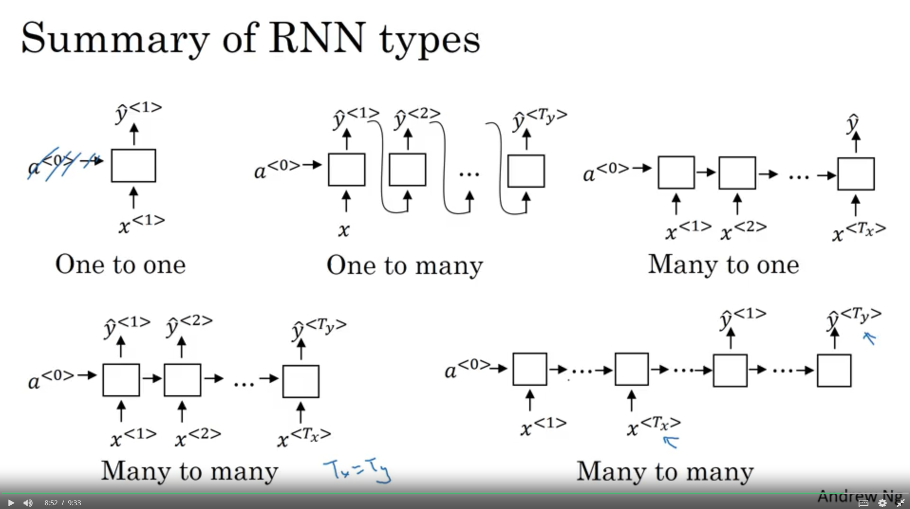

# Deep Learning Specilisation - Course 5 / 5 
# Sequence Models

## Week 1 
### Recurrent Neural Networks
#### 01 - Why sequence models 

examples:

- speech recognition with audioclip x (seq) -> y output of words (seq)
- music generation x -> y (sequence data)
- sentiment classification (sequence) input string -> rating
- DNA sequence analysis
- machine translations
- video activity recognition
- Named entity recognition

#### 02 - Notation

motivating example:

- Named entity recognition
- x: Harry Potter and Hermione Granger invented a new spell
  - for indexing words $x^{<t>}$, here $x^{<1>} - x^{<9>}$
  - $T_x = 9$ : length of input x
- y: 1 1 0 1 1 0 0 0 0 (is word part of person)
  - y^{<t>}
  - $T_y = 9$: length of input y
- for different training examples: $x^{(i)<t>}$, $y^{(i)<t>}$
  - $T_x^{(i)}$
  
representing words:

- create array of vocabulary
- dictionary: 10k is small, 30 - 50k is common, 100k and above rare, but used
- words will use one-hot encoding, e.g. harry has only zeros, but 1 in index 4075
- if words not found in dictionary, we use <unk> (unknown)

#### 03 - Recurrent Neural Network Model

why not a standard nn:

- first problem
  - input, output can be different length in different examples
  - padding for maximum length would be needed
- does not share features learned across diff. positions of text
  - similiar in cnn, things learned should generalize quickly
- will reduce parameters in model

recurrent neural networks

- read first word, take it to first hidden layer, predict $\hat{y}^{<i>}$
- second layer is the same, but gets input $a^{<i>}$
- repeat until last layer $x^{<T_x>}$
- layer some times drawn with loop sign
- layers have some shared parameters
  - $W_{ax}$ will be shared for every time-step
  - connecting parameters will share $W_{aa}$
  - output prediction for each layer has $W_{ya}$
- information will be just reused for the next words, not reversed
- limit: prediction at certain time uses info from earlier 
- $\Longrightarrow$ BI-directional RNN (BRNN) 

forward propagation:

- $a^{<0>}$ = 0
- $a^{<1>} = g( W_{aa} a^{<0>} + W_{ax} x^{<1>} + b_a)$
- $y^{<1>} = g( W_{ya} a^{<1>} + b_y)$
- activiations often tanh / ReLu
- in general:
  - $a^{<t>} = g( W_{aa} a^{<t-1>} + W_{ax} x^{<t>} + b_a)$
  - $y^{<t>} = g( W_{ya} a^{<t>} + b_y)$

simplified rnn notation:
  - $a^{<t>} = g( W_{aa} a^{<t-1>} + W_{ax} x^{<t>} + b_a)$
  - $y^{<t>} = g( W_{ya} a^{<t>} + b_y)$

$$
a^{<t>} = g( W_{a} [ a^{<t-1>}, x^{<t>} ] + b_a)
$$ 
- with $[W_{aa}; W_{ax}] = W_a$, stack in columns
- $[ a^{<t-1>}, x^{<t>} ]$ means we stack the vectors rows together
- advantage: just 1 parameter matrix $W_a$

$$
\hat{y}^{<t>} = g(W_y a^{<t>} + b_y)
$$

#### 04 - Backpropagation through time

- Loss: $L^{<t>} =  - y^{<t>} \log \hat{y}^{<t>} - (1-y^{<t>} \log (1- \hat{y}^{<t>}))$
- Loss for all: $\sum_{t=1}^{T_y} L^{<t>} (\hat{y}^{<t>}, y^{<t>})$

#### 05 - Different types of RNNs

**Many-to-many**
- $T_x = T_y$
  - architecture (input many, many outputs) like before
- $T_x \neq T_y$
  - e.g. machine transiation
  - two distint parts: encoder takes input
  - decoder outputs translation

**Many-to-one** architecture

- e.g. sentiment classification
- x: text, e.g. "nothing to like in this movie"
- y: 0/1 -> 1..5
- wont need output for each time step, just for the last

**one-to-many** architecture
  - e.g. music classicfcation
  - input x: integer, or genre, first note
  - output y: is time-series

**one-to-one** architecture
  - like first two courses (default nn)
  

#### 06 - Language model and sequence generation

speech recognition
- the apple and pair salad
- the apple and pear salad
- lang. model: whats the probability for the 1/2 sentence?
  - P(sentence) = ?

building language model:

- training set: large corpus (large set) of english text
- get sentence
- tokenize: form vocabulary and map to indices, extra Token <EOS> (end of sentence)
- what if not found in vocabulary? <UNK> token.

rnn model:
e.g. "cats average 15 hours of sleep a day. <EOS>"

- $a^{<i>}$ softmax with 10k dim to predict probabilty of first word, with input 0 vector
- second will get the correct first word ("cats"), predict cats + NEW_WORD
- repeat, 3rd gets "cat average"
- end up feeding total sentence (...day) should predict EOS for last layer
- define cost function, get overall Loss
- new sentence P(y1,y2,y3) = P(y1) * P(y2 | y1) * P(y3 | y1,y2)

#### 07 - Sampling novel sequences

sampling:

- softmax prob, randomly sample to softmax distribution
- take random value
- feed as input for next activation layer
- if <EOS> keep sampling (if you have inside vocabulary)
- or just do it for 20, 100 words
- resample if you want to avoid <UNK>

character-level language model

- vocabulary can also be not like: [a, aaron, ... zulu]
- could be = [a,b,c,...,z, ., , , A..Z]
- advantage: you can represent all words
- disadvantage: much longer sequences
- for long dependencies this is harder / needs more computing power

#### 08 - Vanishing gradients with RNNs

example: 

- "the **cat**, which already ate ....., **was** full"
- "the **cats**, ...... , **were** full"
- long-term dependencies
- need to memorize sing / plural for a real long time
- basic rnn model: values influenced by "near" layers
- difficult to backprop the error in this case
- exploding gradients: can decrease/increase exponentially (increase is super-rare, but easy-to spot)
  - use gradient clipping (look gradient vector > threshold -> Clip it)

#### 09 - Gated Recurrent Unit (GRU)

RNN Unit:
$$
a^{<t>} = g( W_{a} [ a^{<t-1>}, x^{<t>} ] + b_a)
$$ 

- idea from Cho & Chung 2014
- gets new memory cell $C$
- $c^{<t>} = a^{<t>}$ for GRU
- $\tilde{c}^{<t>} = \tanh (  W_c [c^{<t-1>},x^{<t>}] +b_c )$
- $\Gamma_u$ (gamma_u): gate value (think of just 0 / 1)
  - in practice: $\Gamma_u = \sigma (W_u [c^{<t-1>},x^{<t>}] + b_u)$
  - $\Gamma_u$: u for "update" 

$$
c^{<t>} = \Gamma_u * \tilde{c}^{<t>} + (1- \Gamma_u) * c^{<t-1>}
$$

- gamma is so close to 0, so value is not vanishing over time 
- is simplified GRU

Full GRU: (with $\Gamma_R$)
$$\tilde{c}^{<t>} = \tanh (  W_c [ \Gamma_R * c^{<t-1>},x^{<t>}] +b_c )$$

$$\Gamma_u = \sigma (W_u [c^{<t-1>},x^{<t>}] + b_u)$$

$$ \Gamma_r = \sigma(W_r [c^{<t-1>},x^{<t>}] + b_r) $$

$$c^{<t>} = \Gamma_u * \tilde{c}^{<t>} + (1- \Gamma_u) * c^{<t-1>}$$

#### 10 - Long Short Term Memory (LSTM)

| GRU | LSTM |
| - | - |
| $$\tilde{c}^{<t>} = \tanh (  W_c [ \Gamma_R * c^{<t-1>},x^{<t>}] +b_c )$$  | $$ \tilde{c}^{<t>} = \tanh (  W_c [ \Gamma_R * a^{<t-1>},x^{<t>}] +b_c )  $$|
| $$\Gamma_u = \sigma (W_u [c^{<t-1>},x^{<t>}] + b_u)$$| $$\Gamma_u = \sigma (W_u [a^{<t-1>},x^{<t>}] + b_u)$$ |
| $$ \Gamma_r = \sigma(W_r [c^{<t-1>},x^{<t>}] + b_r) $$| $$\Gamma_f = \sigma(W_f [a^{<t-1>},x^{<t>}] + b_f) $$  |
| |  $$\Gamma_o = \sigma(W_o [a^{<t-1>},x^{<t>}] + b_o) $$  |
| $$c^{<t>} = \Gamma_u * \tilde{c}^{<t>} + (1- \Gamma_u) * c^{<t-1>}$$|  $$c^{<t>} = \Gamma_u * \tilde{c}^{<t>} + \Gamma_f * c^{<t-1>}$$ |
| $$a^{<t>} = c^{<t>}$$ | $$ a^{<t>} = \Gamma_o * c^{<t>} $$ |

- gates for update U, forget f, output o
- good at memorizing for long time
- sometimes seen with peephole connection 
  - gate values also contains $a^{<t-1>}$ & $c^{<t-1>}$

#### 11 - Bidirectional RNN

- getting information from the future
- is teddy? name or thing? 
- unidirectional rnn´s : RNN, GRU, LSTM Block
- with bidirectional rnns this issue gets fixed

BRNN:

- adds backward connection for each a
- connect all of them 
- is a *Acyclic graph*
- is forward ppopagation (but starting from left to right, switch to right to left direction)
$$ \tilde{y}^{<t>} = g ( Wy [ \leftarrow_{a}, \rightarrow_a ] + b_y) $$
- good start BRNN with LSTM Blocks

#### 12 - Deep RNNs

- remember: $a^{[l]<t>}$, l for layer, t for block
- e.g. $a^{[2]<3>} =  g( W_a^{[2]} [a^{[2]<2>}, a^{[1]<3>} +b_a^{[2]})$
- deep RNN are computational expensive
- 3 deep recurrent layers is common

## Week 2 - Natural Language Processing & Word Embeddings

### Introduction to Word Embeddings

#### 13 - Word Representation

- way of representing words
- allows smaller training set
- reduce bias this week

Word representation:
- V = [a,aaron, .... , <EOS>], $|v| = 10k$ - One Hot Encoding
- featurized representation for words: (e.g. Man, Woman, King, Queen, Apple Orange)
  - Gender : -1, 1, -0.9, 0.9, 0, 0.01
  - Royal: 0.01, 0.02, 0.93, 0.95, ...
  - Age: 
  - Food: 
  - etc..
- man in vocubalary index: 5391 -> $e_{5391}$
- so we can figure out apple, orange are more similiar than apple and king 
- 300D feature space can be visualized to 2d map with: t-SNE

#### 14 - Using word embeddings

named entity recognition example:
- transfer learning possible from huge amount of texts (freely available on the internet)
- learn word embeddings from large text corpus / download pre-trained embedding online
- transfer embedding to new task with smaller training set
- optional: continue to finetune the word embeddings with new data

relation to face encoding:
- siamese network architecture
- compares encoding of face
- encoding & embedding is almost the same
- face encoding will work for all new pictures
- word embedding learns fixed embedding for all the words in the vocabulary

#### 15 -  Properties of word embeddings

- man -> Woman as King -> ?
- can an algorithm figure this out ?
- $e_{man}, e_{woman}, e_{king}, e_{queen}$
  - $e_{man} - e_{woman} \approx \begin{bmatrix} -2 \\ 0 \\ 0 \\ 0 \end{bmatrix} $
  - $e_{king} - e_{queen} \approx \begin{bmatrix} -2 \\ 0 \\ 0 \\ 0 \end{bmatrix} $
- main difference is gender
- $e_{man} - e_{woman} \approx e_{king} - e_?$ 
- accuracy between 30-75%
- idea by Mikolov, 2013
- for showing parallel relationships:
  - t-SNE: Maps 300D -> 2D, non linear mapping

Cosine similiarity
$$ sim(e_w, e_{king} - e_{man} + e_{woman}) $$
$$ sim(u,v) = \frac{u^Tv}{|| u||_2 ||v||} $$

#### 16 - Embedding matrix

- use 10k dimensional vocabulary
- learn embedding Matrix $E$ with D:(300, 10000)
- One Hot Vector, e.g. $O_{6257}$ we get:
  - $E (300,10k) * O_{6267} (10K, 1) = D:(300,1) = e_{6257}$
  - will select the column corresponding to the word
  - not efficient to look up an embedding, better to use specialized function

### Learning Word Embeddings: Word2vec & GloVe

#### 17 - Learning word embeddings

- researcher started to use very complex algorithm
- but they found very simple algorithm, which work just great for lots of data

Neural language model:
- I want a glass of orange _________
- 4343, 9665, 1, 3852, 6163, 6257
- for each word repeat:
  - $o_{4343} \longrightarrow E \Longrightarrow e_{4343}$
  - feed all of them to a hidden layer
  - apply softmax afterwards
- Parameters of model: Matrix $E$ ,w[1] & b[1], w[2] & b[2]

other context/target pairs:
I want a glass of orange juice to go along with my cereal
- target: juice
- context: last 4 words, can be extended to 4 words on left & right
- predict word in the middle
- alternatives: last 1 word, nearby 1 word

#### 18 - Word2Vec

skip-grams:
- I want a glass of orange juice to go along with my cereal.
- Context -> Target
  - randomly pick one word for context
  - pick target word (nearby, +-5 window) 
- supervised learning problem: just used for word embeddings

model: 
- vocab size = 10k
- Map: Context c ("orange") $\longrightarrow$ Target t ("juice")
- $O_c \longrightarrow E \longrightarrow e_c \longrightarrow o (softmax) \longrightarrow \hat y$

problems with softmax classification:
- compute cost (sum of vocabulary size)
- solution: hierarchical softmax (common words on top of tree, rare words buried)

how to sample the context c ?
- randomly sample 
- common words should not dominate the model, use them in balance

#### 19 - Negative Sampling

- by Mikolov, 2013: Distributed representation of words and phrases and their compositionality
- **context + word -> Target 1/0**
  - orange juice ->  1
  - orange king ->  0
  - orange book -> 0 
  - orange the -> 0
  - orange of -> 0 
- pick context word, pick target word with label 1
- for k times take same context word, take random words of dictionary and label all 0
- k is recommended to be 5-20 (small datasets), or 2-5 (larger datasets)

Model:
- $P(y=1| c,t) = \sigma ( \Theta_t^T e_c )$
- for 1 positive example you have k negative examples
- imagine 10000 binary classifier for all words in vocab
- not softmaxing with 10000 -> 10000 binary classifier
- for each iteariton train k+1 classifiers, not all

selecting negative examples:
- samping words by empirical frequency $P(w_i)$ - get lots of the, of, and ..
- author reported best: $P(w_i) = \frac{f(w_i)^{\frac{3}{4}}}{  \sum_{j=1}^{10000} f(w_j)^{\frac{3}{4}}}$

#### 20 - GloVe word vectors

- by Pennington, 2014 : GloVe - Gloval vectors for word representation
- $x_{ij}$ #times i appears in context of j (i = target t, j = context c)

model: 
- minmize $\sum_{i=1}^{10000} \sum_{j=1}^{10000} f(X_{ij}) ( \Theta_i^T e_j + b_i + b_j' - \log X_{ij})$
  - weighting term $f(X_{ij})$ so 0 log 0 = 0
  - common words get less weight, and uncommon not to much weight
  - $b_i$: target t
  - $b_j$: target c

### Applications using Word Embeddings

#### 21 - Sentiment Classification

- looking at text: like or dislike what he talks about
- the dessert is excellent: 4/5 stars
  - sum or average all inputs -> softmax -> $\hat{y}$
  - average would work for all text sizes (5 or 50 words)
  - ignores word order (completely lacking in good taste, good service and good ambience -> would be rated like 4/5, because lots of good)

rnn for sentiment classification:
- take one hot vecotr
- multiply by embedding matrix E 
- feed these to RNN  

#### 22 - Debiasing word embeddings

- by Bolukbasi, 2016: Man is to computer pragrammer as woman is to *homemaker*? 
- Father:Doctor as Mother:Nurse
- word embeddings can reflect gender, age, sexual orientation and other biases of the text used to train the model

addressing bias in word embeddings
1. Identify bias direction : $e_{he} - e_{she}, \dots$ and average them
2. Neutralize: for every word that is not definitional, project to get rid of bias (not for grandfather, but do it for doctor)
3. Equalize pairs like : girl/boy, grandmother/grandfather

## Week 3 - Sequence models & Attention mechanism

### Various sequence to sequence architectures

#### 23 - VortragBasic Models

sequence to sequence model:
- by sutskever, 2014: Sequence to sequence learning with NN
- by Cho 2014: Learning phrase representations
- translate french sequence to english sequence
- given enough pairs of french, english sentences -> it works decently well
- network: Encoder Network -> Decoder Network (for translation)

image captioning:
- input image, output caption, e.g. *a cat sitting on a chair*
- learn features from input image (encoding), remove softmax layer to get vector representing the cat -> takes place of encoding network
- feed this to rnn to generate caption

#### 24 - Picking the most likely sentence

- language model network
  - P(y)
- machine translation: 
  - encoding network
  - decoding network: *language model* from before
  - P(y | x ) : *conditional language model*

most likely translation:

- dont sample at random, find a sentence maximizing propability
- most common is beamSearch
- why not greedy search ?

greedy search

- e.g. 2 translations
  - Jane is visiting Africa in September (better translation)
  - Jane is going to be visiting Africa in September
- because jane is going is more common than visiting, it would choose going.

#### 25 - Beam Search

1. whats the probabilty of the first word, given x (french)
   - beam search supports multiple candidates for the words
   - $B=3$ beam width
   - select 3 highest words
2. uses all the beam to evaluate the network fragments
   - $P (y^{<1>}, y^{<2>} | x) = P(y^{<1>} | x) * P(y^{<2>} | x,y^{<1>})$
   - for 2nd step you are calculating *beam width* * vocabulary size and pick top *beam width (3)* again
3. repeat :) 

- B=1 $\Longrightarrow$ greedy search

#### 26 - Refinements to Beam Search

Length normalization:

- multiplying numbers smaller than 1 can get too small to get stored accurately
- instead of maximizing product: $argmax \prod P(y^{<t>} | x,y^{<1>}, \dots , y^{<t-1>}$ 
- we maximize the log of the Product: $argmax \prod \log P(y^{<t>} | x,y^{<1>}, \dots , y^{<t-1>}$
- if we do another change the algorithm improves more:
  - for very long sentences the prob will get smaller in the end
  - undesireable: prefers short translation / output
  - normalize by number of words in translation: $\frac{1}{Ty^\alpha} \prod \log P(y^{<t>} | x,y^{<1>}, \dots , y^{<t-1>}$
  - alpha is hyperparameter for "normalization", between 0-1

discussion:
- Beam width B: 
  - larger -> better sentence, but higher computation (slower)
  - smaller -> worse result, but faster
  - 10 is common for production - maybe 100
  - for papers it could be 1000 or 3000 to get the best results possible
  - gains are higher from 1-3-10 : 1000-3000
  - Beam search is faster than Breadth first search (BFS) or Depth First Search (DFS), but its not guaranteed to find maximum

#### 27 - Error analysis in beam search

- Translation
  - y* human: Jane visits Africa in september 
  - $\hat{y}$ algorithm: Jane visited Africa last September
- RNN computes P(y*|x) and P($\hat y$ | x), which one is bigger?
- Case 1 :  P(y*|x) > P($\hat y$ | x)
  - Beam search is at fault
- Case 2:  P(y*|x) $\leq$ P($\hat y$ | x)
  - RNN predicted $\hat y$ is the better one
  - RNN model is at fault

error analysis process:

- find mistake root is by rnn or beam search 
- get higher faction of errors and improve this one

#### 28 - Bleu Score (optional)

- what to do if you got multiple equally good translations?
- by papineni, 2002: method for automatic evaluation of machine translation
- e.g. 
  - ref 1: the cat is on the mat
  - ref 2: there is a cat on the mat
- Bleu score measures how good that translation is
  - Bleu: bilingual evaluation understudy
  - mt output: the the the the the the the (7x the)
- Precision: $\frac{7}{7}$, modified precision: credit only up to maximum time of appearance: ref1($\frac{2}{7}$)
- for bleu score you want to see pairs of words -> on bigrams
  - mt output: the cat the cat on the mat (empty)

bigrams | count | count (clip)
- | - | - 
the cat | 2 | 1
cat the | 1 | 0
cat on | 1 | 1 
on the |  1 | 1
the mat | 1 | 1

- modified precision : $\frac{4}{6}$
- more generalized 1 for unigram: $P_1 = \frac{\sum_{unigrams \in \hat{y} } Count clip (unigram) }{ \sum_{unigrams \in \hat{y} } Count (unigram)  }$ 
- n-gram version:$P_n$
- $p_n$ = Bleu score on n-grams only
- Combined Bleu score : $BP* \exp ( \frac{1}{4} \sum_{n=1}^4 p_n)$
- with BP: brewity penalty

#### 29 - Attention Model Intuition

- humans translate sentences part by part, because its hard to memorize real long sentences
- for encoding - decoding architecture is working good for short sentences (up to 30/40 words)

attention model intuiton:

- use 2 rnns, for hidden architecture use s, instead of a for activations
- what parts you need to look for predicting the first word? first, maybe the first few words
- attention words weight: $\alpha^{<1,1>}$, $\alpha^{<1,2>}$
- how much attention we need to weight the single words for the word on index 1, ... , n

second step:

- new set of attention weights for the second word in the sequence
- context c should be a vector with all the weights

#### 30 - Attention Model

model:
- t' for input sentence (french)
- for the s architecture:
  - input c, output y
- context **c** is dependent of attention weights $\alpha$
  -  weighted sum of features
  -  $\sum_{t'} \alpha^{<1,t'>} = 1$
  -  $c^{<i>} = \sum_{t'} \alpha^{<1,t'>} a^{<t'>}$
  -  $\alpha^{<t,t'>}$: amount of attention y^t should pay to a^t

computing attention  $\alpha^{<t,t'>}$

-  $\alpha^{<t,t'>} = \frac{\exp(e^{<t,t'>})}{\sum_{t'=1}^{T_x} \exp{e^{<t,t'>}} }$
-  very small neural network to get $e^{<t,t'>}$
   -  with input $a^{<t'>}, s^{<t-1>}$
   -  mostly 1 hidden layer
- takes quadratic time for computation: $T_x * T_y$
- for machine translation all sentences are rather short, so its acceptable

### Speech recognition - Audio data

#### 31 - Speech recognition

- given audio clip x -> find transcript y
- microphone measure air pressure, plot air pressure vs time
- common preprocessing: generate spectogram time vs frequency, with colors showing energy (volume)
- you can use attention model for speech recognition, too
- or use CTC cost (Connectionist temporal classification)

#### 32 - Trigger Word Detection

- examples:
  - Amazon echo: Alexa
  - Apple Siri: Hey Siri
  - Google Home: Okay, google
- there is no best algorithm for trigger word detection (evolving currently)
- first example
  - set all words until the trigger word to be ignored (target label 0)
  - label with 1 for trigger word
  - inbalanced training set: lots of 0, rarely 1
  - hack: output few 1 before reverting back to 0 after trigger word

### Conclusion

#### 33 - Conclusion and thank you

- watch the video yourself :) 

Course ended: 15.7.19